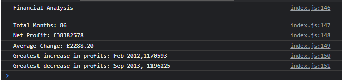

# George Ryder - Console-Finances

## Description

A project to analyse the financial records of a fake company.

My motivation for this project was to gain a greater understanding of JavaScript (JS), before this project my understanding of the language was limited and this is something that I wished to expand upon by completing this challenging project. As mentioned, I built this project to further understand JS. Within JS, however, by completing this project, I got a far greater understandin of loops, conditional statements and arrays. This project was also built as it serves a purpose of being able to analysis simple financial information to provide information such as net change and the biggest months for profit and loss. This project would help to solve a problem for anyone that needs financial data analysing. Users would have to input their monthly profits/losses and then the rest of the program would analyse this data and produce simple results that can be read from the console. Perhaps if a future version were to be made of this, it could read data from an external file instead of the data having to be written manually into an array. It could also be more user friendly in the future and display on the webpage and not in the console. I learnt a lot whilst doing this project. I learnt a lot about loops, conditional statements and arrays. Initially I struggled with finding out the monthly change in profit and trying to figure out how to get the [i] value of the main array to be subtracted with the [i+1] value of the array. However, I believe the solution I came up with works well, it could perhaps be improved in the future by using a nested for loop or something similar. In the end I subtracted it away using an if statement and pushed these into a new array that could be worked on seperately. I also struggled with finding the highest and lowest amount in the array initially and printing out the month that the highest and lowest related to. However, through creating some extra variables for the month and explicitly setting the increase and decrease variables to be the first item in the array, I was able to get it working.

## Installation

Github repository: https://github.com/NotGeorgeHere/Console-Finances

Live Deployment Page: https://notgeorgehere.github.io/Console-Finances/

## Usage

 

## License
N/A

